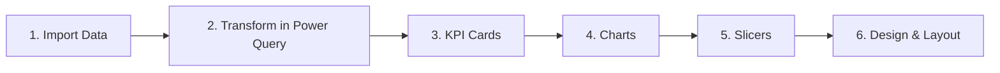

# Hospital Patients Dashboard (Power BI)

**An interactive Power BI dashboard I built as the capstone for a Power BI course on Hash Plus — analyzing hospital patients, treatment costs, departments, and cities.**

---

## Table of Contents
- [About the Course](#about-the-course)
- [What the Project Contains](#what-the-project-contains)
- [How I Built It](#how-i-built-it)
- [Key Metrics](#key-metrics)
- [Insights](#insights)
- [Dashboard](#dashboard)
- [Skills Demonstrated](#skills-demonstrated)
- [Author](#author)

---

## About the Course

This project was my final deliverable for a **Power BI** course offered by [Hash Plus](https://hashplus.com), an Arabic online learning platform. It is the third step in my data analysis learning path, after the [Excel Fundamentals](https://github.com/wajd-cs/telecom-data-analysis-excel) and [Data Analysis Using Excel](https://github.com/wajd-cs/book-fair-dashboard-excel) projects — moving from spreadsheets to a dedicated business intelligence tool.

After completing the course, I built this dashboard to apply what I learned, and received a certificate **Awarded with Distinction**.

## What the Project Contains

A Power BI report built on a dataset of hospital patient records (data in Arabic), with five columns:

| Column | Description |
|---|---|
| Patient ID | Unique identifier for each patient |
| Department | Cardiology, Orthopedics, Pediatrics, Internal Medicine, Emergency |
| City | Riyadh, Jeddah, Makkah, Madinah, Dammam, Khobar, Abha |
| Length of Stay (days) | Number of days the patient was admitted |
| Cost | Treatment cost in SAR |

The dashboard includes:

- **4 KPI cards** — number of patients, average cost, highest cost, lowest cost
- **2 charts** — total cost by department (column chart) and patients by city (pie chart)
- **2 slicers** — filter the whole report by department or city

## How I Built It

**1. Imported the data** from an Excel workbook into Power BI.

**2. Transformed it in Power Query** — promoted the first row to headers and set the correct data type for each column (text for IDs and categories, whole numbers for days and cost), so every calculation works on clean, typed data.

**3. Built KPI cards**, each using a different aggregation on the same data:

| KPI | Aggregation |
|---|---|
| Number of patients | Count of Patient ID |
| Average cost | Average of Cost |
| Highest cost | Max of Cost |
| Lowest cost | Min of Cost |

**4. Created charts** that answer two questions:

| Chart | Type | Question |
|---|---|---|
| Cost by department | Column | Which departments cost the most? |
| Patients by city | Pie | Where do patients come from? |

**5. Added slicers** for department and city. Since all visuals share one data model, selecting a department or city filters every card and chart on the page at once.

**6. Designed the layout** — KPI cards on top, charts and slicers below, with a consistent purple theme.

## Key Metrics

| Metric | Value |
|---|---|
| Number of patients | 10 |
| Average cost | ~4,290 SAR |
| Highest cost | 9,000 SAR |
| Lowest cost | 900 SAR |
| Departments | 5 |
| Cities | 7 |

## Insights

- **Cardiology is by far the most expensive department**, with a total cost of nearly 17K SAR — around 40% of all treatment costs and more than six times Emergency, the least expensive.
- **Riyadh has the most patients** (30%), followed by Jeddah (20%), while each of the remaining five cities has one patient.
- **Costs vary widely** — the highest single cost (9,000 SAR) is ten times the lowest (900 SAR), showing how much the department drives the cost of care.

*Note: with only 10 records, this project focuses on demonstrating Power BI techniques and dashboard design rather than statistically significant findings.*

## Dashboard

## Skills Demonstrated

- **Power Query** — importing and preparing data with correct headers and data types
- **Aggregations** — using Count, Average, Max, and Min on the same dataset for different KPIs
- **Data Visualization** — choosing chart types that match each business question
- **Interactive Filtering** — slicers that filter the entire report through a shared data model
- **Dashboard Design** — organizing KPIs, charts, and filters into one clear, consistent layout
- **Business Thinking** — turning cost and patient data into observations a hospital could act on

## Author

**Wajd Alluhaibi**
Computer Science Student | Data Analysis & Software Development

